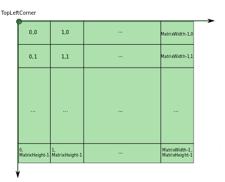

[  ](https://bintray.com/peterlaurence/maven/mapview/1.0.7/link)

# MapView

MapView is a Fast, Memory Efficient android library to display tiled maps with minimal effort.

```kotlin
val mapView = MapView(context)
val tileStreamProvider = object : TileStreamProvider {
   override fun getTileStream(row: Int, col: Int, zoomLvl: Int): InputStream? {
     return FileInputStream(File("path_of_tile")) // or it can be a remote http fetch
   }
}

val config = MapViewConfiguration(levelCount = 7, fullWidth = 25000, fullHeight = 12500,
                                  tileSize = 256, tileStreamProvider = tileStreamProvider)
                                  .setMaxScale(2f)

/* Configuration */
mapView.configure(config)
```

MapView shows only the visible part of a tiled map, and supports flinging, dragging, and scaling. It's also possible to
add markers and paths.

This project holds the source code of this library, plus a demo app (which is useful to get started).

## Installation

Add this to your module's build.gradle
```groovy
implementation 'com.peterlaurence:mapview:1.0.7'
```

## Origin and motivation

As a long time contributor to [TileView](https://github.com/moagrius/TileView), which is a reference in this area, I
wanted to see the performance we would have using Kotlin coroutines. The result was beyond my expectations and this is
why I'm sharing it the world. The overall design can be seen [here](https://github.com/peterLaurence/MapView/wiki/TileCollector-design).
The focus has been on efficiency (no thread contention thanks to asynchronous programming, and the load on the main thread is low enough to maximize the fps).

A special thanks goes to Mike (@moagrius), as this library wouldn't exist without his first contributions.

## Principles

### Deep-zoom map

MapView is optimized to display maps that have several levels, like this:

<p align="center">

</p>

Each next level is twice bigger than the former, and provides more details. Overall, this looks like a pyramid. Another common name is "deep-zoom" map.
This library comes with a demo app, which shows basic usage of the MapView and bundles a map in the assets. Looking at structure of this map, you have a real example of a deep-zoom map.

MapView can also be used with single level maps.

### Usage

To use the MapView, you have to follow these steps:
1. Create a MapView instance
```kotlin
val mapView = MapView(context)
``` 
2. Create a `TileStreamProvider`. See [below](#TOC-TileStreamProvider) for the details.
3. Create a `MapViewConfiguration`. See [below](#TOC-MapViewConfiguration) for the details.
4. Apply the configuration
```kotlin
mapView.configure(config)
```

### Convention

MapView uses the convention that the last level is at scale 1. So all levels have scales between 0 and 1.
Even though you don't have to be aware of the details, it's important to know that. For example, if you set the max scale to 2, it means that the last level will be allowed to be upscaled to twice its original size (since the last level is at scale 1).
This convention allows for a simple configuration.

## Technical documentation

This section explains in details the configuration. But once configured, you can do a lot of things with your `MapView`
instance. There is just one thing to remember: `MapView` extends [ZoomPanLayout](mapview/src/main/java/com/peterlaurence/mapview/layout/ZoomPanLayout.kt) and this last class has a ton of 
features (the source code is well documented). You can:

* add listeners to events like pan, fling, zoom..
* programmatically scroll and center to a position
* respond to various touch events by subclassing `MapView` and overload related methods declared in `ZoomPanLayout`

This list isn't complete. A dedicated section will be added.

### <a name="TOC-MapViewConfiguration"></a> MapViewConfiguration

The MapView must be configured using a `MapViewConfiguration`. It holds the mandatory parameters to build a MapView

Then, you can set optional properties by calling available methods on your `MapViewConfiguration` instance. Here is an
example:
```kotlin
val config = MapViewConfiguration(levelCount = 7, fullWidth = 25000, fullHeight = 12500,
                                  tileSize = 256, tileStreamProvider = tileStreamProvider)
                                  .setMaxScale(2f)
                                  .setMagnifyingFactor(1)
```

See documentation [here](https://github.com/peterLaurence/MapView/blob/22121723ca35d987d95518845dac08adf614918d/mapview/src/main/java/com/peterlaurence/mapview/MapView.kt#L275). Below is a description of mandatory parameters:

**`levelCount`**

The provided `MapViewConfiguration.levelCount` will define the zoomLevels index that the provided `MapViewConfiguration.tileStreamProvider` will be given for its `TileStreamProvider.zoomLevels`.
The zoomLevels will be in the range [0 ; `MapViewConfiguration.levelCount`-1].

**`fullWidth` and `fullHeight`**

These are respectively the width and height in pixels of the map _at scale 1_ (that is, the width and height of the last level).
In other words, if you put together all the tiles of the last level, you would obtain a big image. `fullWidth` and `fullHeight` are dimentions in pixels of this big image.

**`tileSize`**

The size of the tiles in pixels, which are assumed to be squares and always of the same size for all levels. For now, MapView don't support rectangular tiles or tiles of heterogeneous sizes.

**`tileStreamProvider`**

See the section below.


### <a name="TOC-TileStreamProvider"></a> TileStreamProvider

The MapView will request tiles using the convention that each levels has its tiles organized like this:

<p align="center">

</p>

But note that MapView isn't opinionated about that. This is one of the purpose of this `TileStreamProvider`:
```kotlin
interface TileStreamProvider {
    fun getTileStream(row: Int, col: Int, zoomLvl: Int): InputStream?
}
```
Your implementation of this interface does the necessary coordinate translation (if required). This is where you do your
HTTP request if you have remote tiles, or fetch from a local database (or file system).

## Create a deep-zoom map

If you don't have already such a map and you need to make one from a big image, follow this [tutorial](doc/libvips.md).


